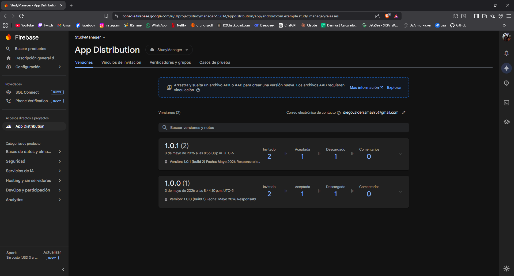
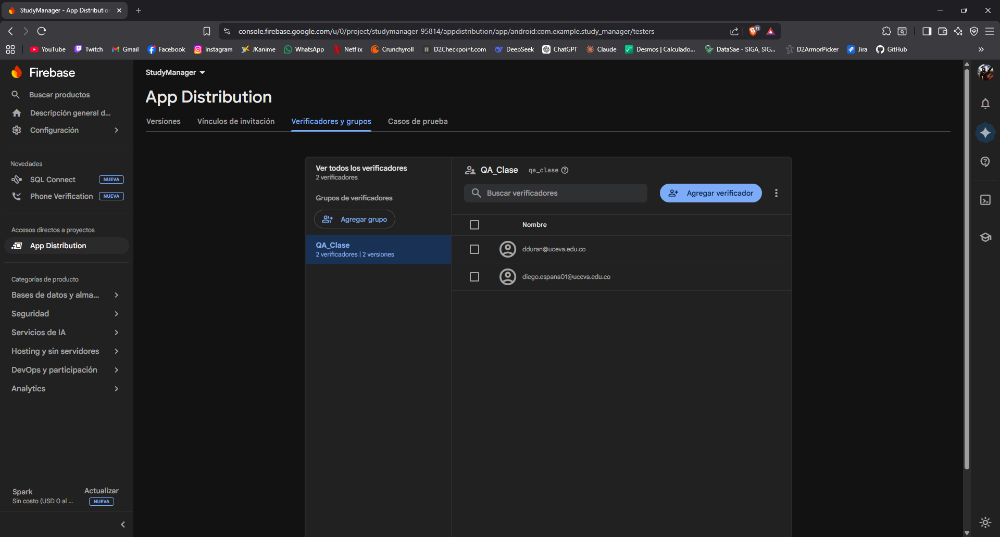
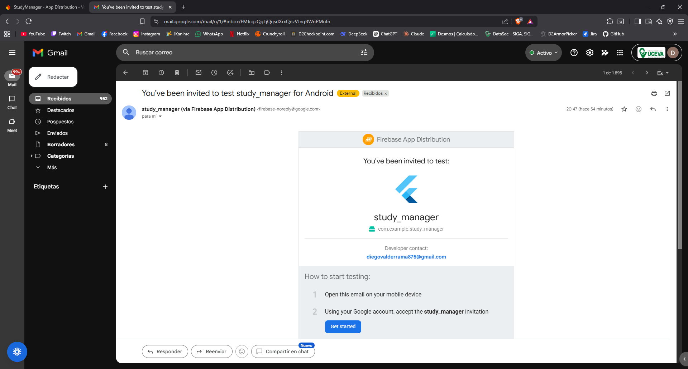
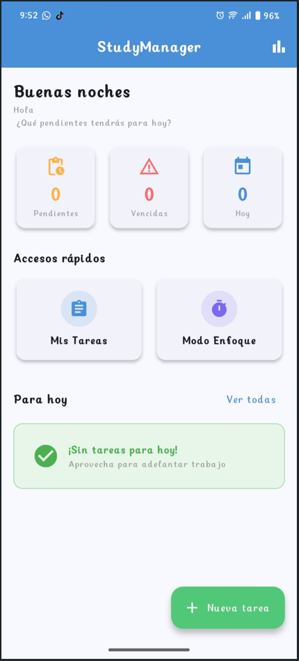
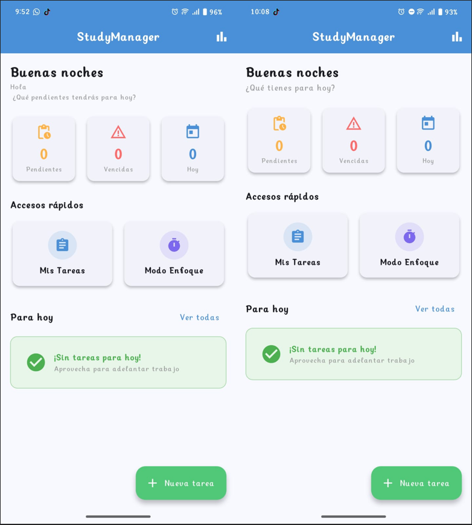

# 📚 StudyManager — Distribución con Firebase App Distribution

Documentación del proceso de distribución y pruebas de **StudyManager v1.0.1** usando Firebase App Distribution como plataforma de distribución de APK para testers.

---

## Tabla de contenidos

1. [Descripción de la app](#descripción-de-la-app)
2. [Flujo de distribución](#flujo-de-distribución)
3. [Publicación — pasos para replicar](#publicación--pasos-para-replicar)
4. [Versionado](#versionado)
5. [Formato de Release Notes](#formato-de-release-notes)
6. [GitFlow](#gitflow)
7. [Capturas del panel](#capturas-del-panel)
8. [Referencias](#referencias)

---

## Descripción de la app

**StudyManager** es una agenda académica inteligente desarrollada en Flutter para estudiantes de secundaria y universidad. Permite organizar tareas, exámenes y trabajos con sistema de prioridades, modo de enfoque Pomodoro y estadísticas de rendimiento.

| Campo | Valor |
|---|---|
| **Plataforma** | Android |
| **Framework** | Flutter 3.x / Dart |
| **Almacenamiento** | SQLite local (sqflite) |
| **Versión actual** | 1.0.1 (build 2) |
| **applicationId** | com.example.study_manager |

---

## Flujo de distribución

El proceso completo desde el código hasta el dispositivo del tester sigue estos pasos:

```
Código fuente (VS Code)
        │
        ▼
[1] flutter build apk --release
        │
        ▼
[2] app-release.apk generado
    build/app/outputs/flutter-apk/
        │
        ▼
[3] Firebase App Distribution
    → Subir APK
    → Asignar grupo QA_Clase
    → Agregar Release Notes
    → Distribuir
        │
        ▼
[4] Testers reciben correo de invitación
    → dduran@uceva.edu.co
        │
        ▼
[5] Tester instala la app en dispositivo Android
        │
        ▼
[6] Pruebas QA — verificar funcionalidades
        │
        ▼
[7] Actualización (1.0.0 → 1.0.1)
    → Cambiar version en pubspec.yaml
    → flutter build apk --release
    → Subir nueva versión a App Distribution
    → Distribuir al mismo grupo
        │
        ▼
[8] Testers reciben notificación de actualización
```

---

## Publicación — pasos para replicar

Sigue estos pasos para replicar el proceso de distribución desde cero en el equipo:

### 1. Preparar el proyecto

Verifica que `pubspec.yaml` tenga la versión correcta:
```yaml
version: 1.0.0+1   # versionName+versionCode
```

Verifica que `android/app/src/main/AndroidManifest.xml` tenga el permiso de internet:
```xml
<uses-permission android:name="android.permission.INTERNET"/>
```

### 2. Generar el APK de release

```bash
flutter build apk --release
```

El APK se genera en:
```
build/app/outputs/flutter-apk/app-release.apk
```

### 3. Configurar Firebase

1. Ir a https://console.firebase.google.com
2. Crear proyecto → `StudyManager`
3. Registrar app Android con el `applicationId` de `android/app/build.gradle`
4. Descargar `google-services.json` → colocar en `android/app/`

### 4. Configurar App Distribution

1. Firebase Console → **App Distribution** → Comenzar
2. Pestaña **Testers & Groups** → **Add group** → nombre: `QA_Clase`
3. Agregar testers al grupo con sus correos

### 5. Subir y distribuir el APK

1. Pestaña **Releases** → **Upload** → seleccionar `app-release.apk`
2. Asignar grupo `QA_Clase`
3. Escribir Release Notes (ver formato más abajo)
4. Clic en **Distribute**

### 6. Verificar distribución

- Los testers reciben un correo con enlace de instalación
- Deben aceptar la invitación y descargar la app
- La app se instala directamente desde el navegador del dispositivo

### 7. Actualización incremental

Para distribuir una nueva versión:
```yaml
# pubspec.yaml — incrementar ambos valores
version: 1.0.1+2
```
```bash
flutter build apk --release
```
Subir el nuevo APK a App Distribution con nuevas Release Notes. Los testers del grupo reciben notificación automáticamente.

---

## Versionado

Flutter usa el formato `versionName+versionCode` en `pubspec.yaml`:

```yaml
version: 1.0.1+2
#        ─────┬─── ─┬─
#             │     └── versionCode (entero, siempre creciente)
#             └──────── versionName (visible al usuario: mayor.menor.parche)
```

### Convención usada en este proyecto

| Campo | Descripción | Ejemplo |
|---|---|---|
| **major** | Cambio grande / incompatible | 2.0.0 |
| **minor** | Nueva funcionalidad | 1.1.0 |
| **patch** | Corrección de bugs | 1.0.1 |
| **versionCode** | Entero siempre creciente, nunca repetir | +2, +3, +4... |

### Historial de versiones

| Versión | versionCode | Fecha | Descripción |
|---|---|---|---|
| 1.0.0 | 1 | Mayo 2026 | Primera versión funcional — release inicial |
| 1.0.1 | 2 | Mayo 2026 | Indicador de versión en Dashboard + correcciones de estilo |

---

## Formato de Release Notes

Se usa el siguiente formato estándar para todas las releases:

```
Versión: X.X.X (build N)
Fecha: Mes Año
Responsable: Nombre del desarrollador

[Nombre App] vX.X.X — Descripción breve del release

Funcionalidades incluidas / Cambios:
- Descripción de cada cambio o funcionalidad

Instrucciones de prueba:
1. Paso 1
2. Paso 2
3. ...

Incidencias resueltas (si aplica):
- Descripción del bug y solución aplicada
```

### Release Notes usadas en este proyecto

**v1.0.0 (build 1):**
```
Versión: 1.0.0 (build 1)
Fecha: Mayo 2026
Responsable: Diego España

StudyManager v1.0.0 — Primera versión funcional

Funcionalidades incluidas:
- Dashboard con resumen del día
- Gestión completa de tareas (crear, editar, eliminar, completar)
- Organización por materia, tipo y prioridad
- Modo Enfoque con cronómetro Pomodoro (25/5/15 min)
- Estadísticas de rendimiento con gráficas
- Almacenamiento local con SQLite

Instrucciones de prueba:
1. Instalar la app desde este enlace
2. Crear al menos 3 tareas con distintas materias y fechas
3. Probar el modo enfoque iniciando y pausando el cronómetro
4. Revisar las estadísticas después de marcar tareas como completadas
```

**v1.0.1 (build 2):**
```
Versión: 1.0.1 (build 2)
Fecha: Mayo 2026
Responsable: Diego España

StudyManager v1.0.1 — Actualización incremental

Cambios respecto a v1.0.0:
- Indicador de versión visible en el Dashboard
- Correcciones menores de estilo

Pruebas QA realizadas:
✅ Creación y edición de tareas
✅ Marcado de tareas como completadas
✅ Modo Enfoque — cronómetro funcional
✅ Estadísticas actualizadas correctamente
✅ Navegación entre todas las pantallas

Incidencias encontradas en v1.0.0 y resueltas:
- Ninguna crítica encontrada en pruebas iniciales
```

---

## GitFlow

El proyecto sigue la metodología GitFlow con las siguientes ramas:

```
main ─────────────────────────────────── rama estable
  └── dev ──────────────────────────────── integración
        └── feature/proyecto_integrador ── desarrollo
```

### Flujo seguido

```bash
# Crear ramas
git checkout -b dev
git checkout -b feature/proyecto_integrador

# Commits durante el desarrollo
git commit -m "Primer commit"
git commit -m "Reorganizando estructura de carpetas para el PI"
git commit -m "Nueva lógica principal"
git commit -m "Cambios para la versión 1.0.1+2"

# Merge feature → dev → main
git checkout dev
git merge feature/proyecto_integrador
git checkout main
git merge dev

# Subir al repositorio
git push origin main
git push origin dev
git push origin feature/proyecto_integrador
```

---

## Capturas del panel

### Firebase App Distribution — Releases
> 

### Testers & Groups — QA_Clase
> 

### Correo de invitación
> 

### App instalada en dispositivo
> 

### Actualización (antes/después)
> 
Es un cambio pequeño debajo del saludo para el ejemplo
---

## Referencias

- [Firebase App Distribution — Documentación oficial](https://firebase.google.com/docs/app-distribution?hl=es-419)
- [Flutter — Deployment Android](https://docs.flutter.dev/deployment/android)
- [Flutter — Versionado de apps](https://docs.flutter.dev/deployment/android#reviewing-the-gradle-build-configuration)
- [Firebase Console](https://console.firebase.google.com)

---

*Proyecto desarrollado por Diego Fernando España Valderrama y Santiago Gonzales Gómez · Electiva Profesional I · UCEVA 2026*